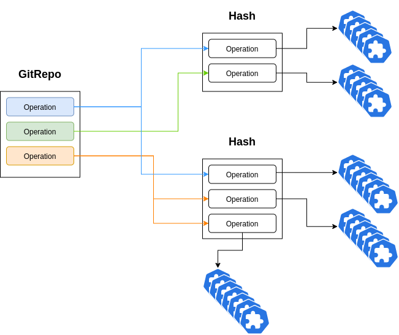

<div style="text-align:center"></div>

# Slipway


Slipway is a Kubernetes controller to automate gitops provisioning. 

In every git repository the commit Hash is the single source of truth on the code at any point in time.
Tags, branches, and pull requests are only pointers to commit hashes, meant for human consumption.


Slipway attempts to tie all provisioned resources to a commit hash and as humans update their references
to commit hashes resources get updated automatically.

## How it works

There are three core components to Slipway.

- The Slipway Controller
- The GitRepo definition
- The Hash definition

## The Slipway Controller

The Slipway Controller is essentially a controller that provisions resources based on the GitRepo 
definitions.

***Currently Supports***
- Kustomize repositories (core to slipway)
- Github (Gitlab and Bitbucket to come soon)
- Git/ssh protocol (http without authentication coming soon)

## GitRepo definition

The GitRepo definition defines how Slipway will read references in a remote repository.

<details><summary>Git References</summary>
<p>
Every branch, tag, pull request in a Git Repository is just a pointer to a commit.

To see this in action we can run a simple git command:

```bash
$ git ls-remote git@github.com:jasonrichardsmith/sentry.git

... (edited for brevity)
269a30b7192705c6b8b3ccaa0356bf0502d5a210	refs/heads/feature/improved_ca_pull
61304a0837814c468c72b5214aa1f840e940a82e	refs/heads/master
e4c00ba1446362dc5cbe2fc76da25b75a73ba147	refs/pull/37/head
269a30b7192705c6b8b3ccaa0356bf0502d5a210	refs/pull/38/head
dd434d99edf1c21077e3d47da46222c021fbaa01	refs/pull/38/merge
07c50cd2e5c0fea2d4cae2abeef1095e51363af0	refs/tags/1.0.0-beta
2fc1ac5ad89798d472a24204d162a4eb7076a5ae	refs/tags/1.1.0-beta
61304a0837814c468c72b5214aa1f840e940a82e	refs/tags/1.2.0-beta
```

Branches and tags are just pointers to hashes and follow the same format
```refs/heads/master``` or ```refs/tags/1.0.0-beta```

Pull requests are specific to the systems you use to manage your git repositories.
So for Github ```refs/pull/38/head``` is an pull request, merged or not, and ```refs/pull/38/merge```
represents a PR waiting to be merged.

Slipway currently supports these patterns.

This can change depending on the tooling you have setup.  To see a different layout but still on github
look at the kubernetes repository.

```
$ git ls-remote git@github.com:kubernetes/kubernetes.git
```

For this reason this will be configurable in Slipway in the future.

All of these references are for human consumption and the hash they point to can be updated.

So in an active repository the has for master should constantly be changing:
```
61304a0837814c468c72b5214aa1f840e940a82e        refs/heads/master
```

</p>
</details>

### A Simple GitRepo

```yaml
apiVersion: git.gitops.slipway.org/v1
kind: GitRepo
metadata:
  name: gitrepo-sample
spec:
  uri: "git@github.com:slipway-gitops/slipway-example-app.git"
  gitpath: "github"
  store:
    type: "s3"
    bucket: "mybucketname"
  operations:
    - operation: test
      path: "git@github.com:slipway-gitops/slipway-example-app.git//kustomize/base"
      hashpath: true 
      weight: 3
      optype: branch
      reference: m[a-z]+r
      transformers:
        - type: annotations
          value: branch
          key: branch-name
        - type: namespace
          value: branch
```
Using the above information the GitRepo will build Hashes and attach all the Operations that apply to that
hash based on the matching rules defined below. A hash can have many references so if a branch and a tag have
been selected by two different operations, they both apply to the Hash, but they will have context from why
they apply (the reference match that occurred).

When the GitRepo creates a Hash it also takes ownership of the Hash, so if you delete the GitRepo all the
Hashes it created and the objects that are created under that Hash are deleted.

The repo pulls down remotes references every minute and updates any hashes based on that.  If a hash is no longer
referenced it is then deleted, and all the objects under it are removed as well.
For example if you push a new commit to a branch, that is now what the branch reference points to, so it gets deployed and
the old hash is orphaned so it gets deleted with the objects it owns.
Only hashes that are referenced by an operation will ever be deployed on the cluster.



#### The Spec

The Spec currently has a URI which should be self explanatory.

##### Gitpath
Is a reference to a plugin by filename
GitPath plugins can be found under the internal/plugins folder

Currently only github is supported and is the default when not set.

##### Store
Is an object that gives you the ability to store any applied configuration
as a manifest in a storage system.  Currently this only supports S3 bu the plugins
can be developed to support any storage layer.

```type``` only currently supports s3 but [new storage plugins can be built](PLUGINS.md).

```bucket``` is the location

The files are stored as hash/operation(name)/unixtime.

AWS Credentials are searched for in the regular AWS SDK fashion.  You can use environment values, credentials
as a secret or [IRSA](https://aws.amazon.com/blogs/opensource/introducing-fine-grained-iam-roles-service-accounts/).

##### Operations
Operations define what references the operation should act on and what it should accomplish and it is
given a weight to establish some semblance of order (waiting has not been built).

***Operation*** The unique name

***Path*** Path to the kustomize folder to execute

***HashPath*** HashPath appends "?ref=" with the commit hash to explicitly pull from your commit

***Weight*** Higher values executed first

***OpType*** Is the type of operation: this could be branch, pull, tag, or highesttag
- "branch" does regex on branch name
- "tag" does regex on tags
- "pull" currently acts on all *open* Pull requests, "reference" is not used.
- "highesttag" performs regex on tag but only acts on the highest version tag that matches the regex

***Reference*** This is a regex expression that gets evaluated based on the optype *(see above)*

<details><summary>Go Code for regex building</summary>
<p>
reference will replace "%v"

```go
		"pull":       `^refs/pull/[0-9]+/merge$`,
		"branch":     `^refs/heads/%v$`,
		"tags":       `^refs/tags/%v$`,
		"highesttag": `^refs/tags/%v$`,
```
</p>
</details>
<br>

###### Transformers

Are an array of kustomize transformers that can be executed against the resources prior to release but
after your kustomize resources in "path" were already assembled.

These transformers are only intended to be used in regards to the context of your references in your git repo.
This means they only modify your objects with values derived directly from a branch, tag, a pull request
, hash, or a plain string. Hence they provide limited functionality.

```
        - type: annotations
          value: branch
          key: branch-name
        - type: namespace
          value: branch
```

There are three parts to a transformer
- "type" The type of transformer (explained below)
- "value" The value to use use from the reference or just a plain string.
	- "branch" - just loads the branch name
	- "pull" - uses "pull-#" for the number of the pull request
	- "tag" - uses the tag
	- any other string just loads as a string, you cannot use the above reserved strings.
- "key" - is intended for labels and annotations transformers it is just meant as the key value in those transformations, it is also
used to identify the container name to modify in images transformer.

***Transformer Types***
- Annotations (annotations) - adds an annotation to all objects based on the "key":"value"
- Labels (labels) - adds label to all objects based on the "key":"value"
- Prefix (prefix) or Suffix (suffix) - adds a prefix "%v-" or suffix "-v%" from the "value" to all objects
- Namespace (namespace) - changes the namespace for all objects to the "value".  Creates the namespace if it does not exist
- Images (images) - changes the image tag to "value" for the container with name given in "key"

### The Hash

The Hash is machine generated and is owned by the GitRepo that generates it.  It should never directly be edited.

```yaml
apiVersion: git.gitops.slipway.org/v1
kind: Hash
metadata:
  creationTimestamp: "2020-03-12T16:16:57Z"
  generation: 1
  name: 08c913b35851c86e074fcfa4e6163f409c165473
  ownerReferences:
  - apiVersion: git.gitops.slipway.org/v1
    blockOwnerDeletion: true
    controller: true
    kind: GitRepo
    name: gitrepo-sample
    uid: 1a8ad902-2c62-4733-bc06-86780acdef68
spec:
  gitrepo: gitrepo-sample
  operations:
  - operation: test
    optype: branch
    path: git@github.com:slipway-gitops/slipway-example-app.git//kustomize/base
    reference: m[a-z]+r
    referencetitle: master
    transformers:
    - key: branch-name
      type: annotations
      value: branch
    - key: ""
      type: namespace
      value: branch
    weight: 3
status:
  active:
  - apiVersion: v1
    kind: ConfigMap
    name: the-map
    namespace: master
    resourceVersion: "1425771"
    uid: 5fde0449-0131-4d6d-89ca-88483c04bf28
    .... // edited for brevity
```
Many of the fields are copied from the operations in the GitRepo.

***Name*** - is just the Hash from the commit

***Referencetitle*** - is the branch, tag, or pull request that was identified by the regex.

***Status*** - stores a reference to all the object the hash has created


### Plugins
To see how plugins are developed please refer to the [PLUGINS.md](PLUGINS.md).

## Running
This project is currently under development and is not intended for production use.

To deploy the controller into a cluster please proceed to the [DEPLOY.md](DEPLOY.md)

To run this for development with kubebuilder.
Start up a cluster (minikube)
and under the root directory run:
```
make # builds the binary and plugins
make install # build and install the manifests
make run ENABLE_WEBHOOKS=false
```

The project requires a valid ssh key to exist at $HOME/.ssh/id_rsa

kustomize ("path" settings)will support http pulls but only on public repositories.
So consider that when setting "path" on an operation.


